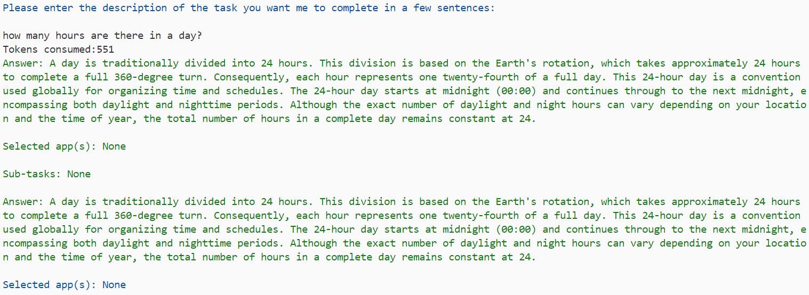
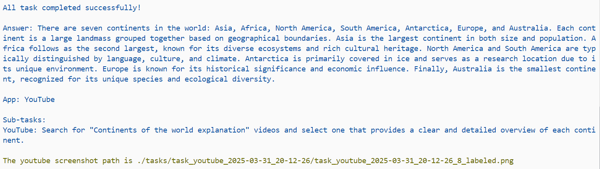
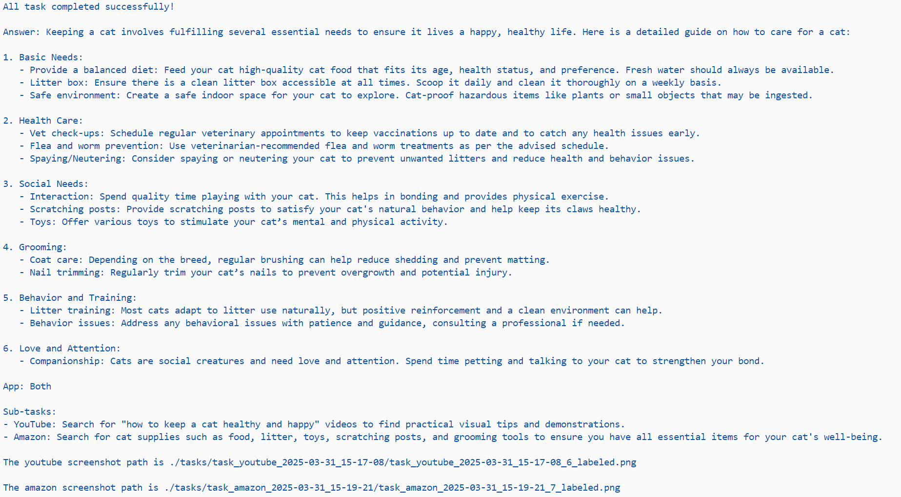

# Demo说明

借助ChatGPT选择使用几个app，选择使用什么app来获取额外信息。最终将额外信息的截图路径与主任务一起返回给用户。

**三个视频分别展示了ChatGPT-4o自己判断利用0/1/2个额外app获取proactive anwser的效果**

### 不使用额外app

**最终回答**：

**video:**

<video src="none_subtask.mp4"></video>

### 使用一个app

**最终回答**：

**video：**

<video src="one_task.mp4"></video>

### 使用两个app

**最终回答：**

**video：**

<video src="two_sub_tasks.mp4"></video>